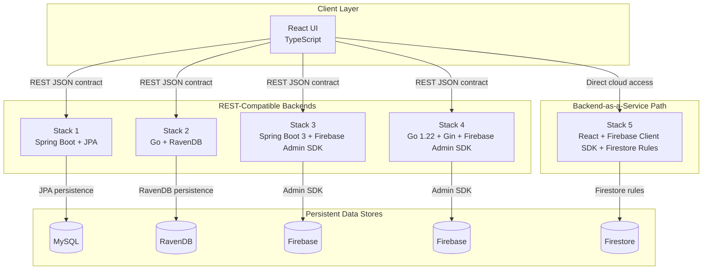

# quick-note-polyglot

[](https://www.java.com/)
[](https://go.dev/)
[](https://react.dev/)
[](https://www.mysql.com/)
[](https://ravendb.net/)
[](https://firebase.google.com/)
[](https://www.docker.com/)

## Executive Summary

quick-note-polyglot is a master hub repository for a note-taking ecosystem implemented as linked Git submodules.

The repository is designed to show one business domain across multiple architectural paradigms:

- one shared React frontend
- two traditional REST backends
- two serverless Firebase-backed services
- one direct-to-cloud BaaS implementation

The goal is comparison, not duplication.

The same note-taking experience is preserved while the implementation stack changes across SQL, NoSQL, JVM, Go, and Firebase-centric designs.

This makes the repository useful as an architecture portfolio artifact because it demonstrates:

- decoupling of client and backend implementation
- polyglot persistence across relational, document, and managed cloud data models
- stable API contracts across different runtimes
- security boundaries that vary by deployment model

## System Architecture Diagram



### Diagram Reading Notes

- The React client is the invariant user interface.
- Stacks 1 through 4 share the same REST JSON contract.
- Stack 5 bypasses the custom backend tier.
- The layered diagram reflects the intended comparison model.

## Submodule Matrix

| Stack Number | Paradigm | Tech Stack | Database | Deployment Strategy | Submodule Link |
|---|---|---|---|---|---|
| Main REST UI | Decoupled frontend | React + TypeScript | None | Static frontend hosting | [Link](https://github.com/DineshMoorthy007/quick-note-react-ui) |
| Stack 1 | Traditional relational | Java Spring Boot + Spring Data JPA | MySQL | Containerized service + relational database | [Link](https://github.com/DineshMoorthy007/quick-note-api-spring-mysql) |
| Stack 2 | Enterprise document REST | Golang + RavenDB | RavenDB | Containerized service + high-performance document database | [Link](https://github.com/DineshMoorthy007/quick-note-api-go-ravendb) |
| Stack 3 | Serverless Java | Java Spring Boot 3 + Firebase Admin SDK | Firebase-managed data | Managed container deployment | [Link](https://github.com/DineshMoorthy007/quick-note-api-spring-firebase) |
| Stack 4 | Serverless Go | Golang 1.22 + Gin + Firebase Admin SDK | Firebase-managed data | Managed container deployment | [Link](https://github.com/DineshMoorthy007/quick-note-api-go-firebase) |
| Stack 5 | Backend-as-a-Service | React + Firebase Client SDK + Firestore Rules | Firestore | Direct-to-cloud frontend | [Link](https://github.com/DineshMoorthy007/quick-note-react-firebase-baas) |

### Stack Notes

| Stack | What It Demonstrates |
|---|---|
| Main REST UI | A single client that can target multiple backend implementations |
| Stack 1 | Classical enterprise REST, SQL discipline, and JPA-based persistence |
| Stack 2 | Compiled Go service with enterprise-grade transactional document persistence |
| Stack 3 | Java on a managed container platform with Firebase integration |
| Stack 4 | Lightweight Go services with the same managed-data pattern |
| Stack 5 | Direct frontend-to-Firebase access governed by security rules |

## Architectural Trade-off Analysis

### SQL vs. NoSQL

| Attribute | SQL | NoSQL |
|---|---|---|
| Structure | Normalized tables | Self-contained documents |
| Strength | Integrity and transactional control | Flexibility and fast schema evolution |
| Cost | More rigid schema design | More discipline in application code |
| Best Fit | Governance-heavy domains | Rapidly evolving note structures |

SQL is strongest when relational integrity matters.

NoSQL is strongest when the note shape is likely to change.

For this domain, both are valid.

The difference is the type of control each stack optimizes for.

### Go/RavenDB vs. JVM/MySQL vs. Firebase

Stack 2 introduces a third data modeling perspective: enterprise-grade transactional document persistence paired with compiled Go binaries.

| Attribute | MySQL + Spring Boot | RavenDB + Go | Firebase Firestore |
|---|---|---|---|
| Data model | Normalized relations | Documents with transactions | Managed cloud-native |
| Language runtime | JVM | Compiled binary | Browser/Node.js |
| Schema enforcement | Database constraints | Application-level | Firestore rules |
| Transaction support | ACID compliance | Multi-document ACID | Eventual consistency |
| Operational depth | High (DBA required) | Medium (managed locally) | Low (managed by platform) |

RavenDB is optimized for applications that need document flexibility without sacrificing transaction safety.

Unlike MongoDB, RavenDB provides multi-document ACID transactions and automatic conflict resolution, making it suitable for enterprise note domains where consistency matters.

Paired with Go, which compiles to a lean binary, Stack 2 represents a middle ground between the operational burden of MySQL/Spring and the platform delegation of Firebase.

Go's memory efficiency and static compilation make it particularly well-suited to RavenDB's query model, resulting in a service that is both performant and relatively simple to operate in containerized environments.

### JVM/Spring Boot vs. Golang

| Attribute | Spring Boot | Go |
|---|---|---|
| Runtime | JVM | Native binary |
| Startup | Heavier | Lighter |
| Artifact size | Larger | Smaller |
| Operational profile | Framework-rich | Minimal and fast |

Spring Boot offers a familiar enterprise model and broad ecosystem support.

Go favors compact binaries and fast startup behavior.

For managed container deployment, the Go variant is better aligned with low-latency execution.

### REST JWT vs. Firebase Rules

| Attribute | REST + JWT | Firebase Security Rules |
|---|---|---|
| Enforcement | Application layer | Data layer |
| Control style | Procedural | Declarative |
| Operational burden | Higher | Lower |
| Best Fit | Custom service boundaries | Direct-to-cloud access control |

REST stacks own their authorization lifecycle.

Firebase delegates most of that work to managed rules.

That reduces custom server logic, but it changes the trust model.

## Global API Contract

Stacks 1 through 4 use the same REST routes and the same JSON payload shapes.

This allows the frontend to switch between implementations without changing client logic.

The shared contract includes:

- identical resource paths
- aligned request and response payloads
- equivalent validation semantics
- comparable error structures

The frontend therefore acts as a stable consumer layer while each backend remains independently replaceable.

## Core Engineering Competencies

- Cross-Origin Resource Sharing enforcement across separated origins.
- Strict REST API contract fidelity across Stacks 1 through 4.
- Docker multi-stage containerization for reproducible builds.
- Firestore Security Rules for direct-to-cloud access control.
- Stateless JWT and token authentication.
- Spring Data JPA persistence with MySQL.
- RavenDB transactional document modeling with compiled Go services.
- Cloud-native container deployment for server-side services.
- Firebase Admin SDK integration for managed cloud operations.
- React + TypeScript client design with backend abstraction.
- Comparative architecture across monolith, serverless, and BaaS models.

## Quick Start

### Clone the full ecosystem

```bash
git clone --recursive <url>
cd quick-note-polyglot
git submodule update --init --recursive
```

### Review order

1. Open the Main REST UI first.
2. Compare Stack 1 and Stack 2 as the two REST-first backends.
3. Review Stack 3 and Stack 4 as the serverless managed-container variants.
4. Review Stack 5 last because it removes the backend tier entirely.

### Deployment note

- If you are validating the serverless stacks, deploy them through Cloud Run as the final hosting step.

## Reviewer Guidance

Focus on the following during review:

- whether the UI stays stable across backend swaps
- whether the API contract remains identical in Stacks 1 through 4
- whether persistence choices match the problem shape
- whether the security model matches the hosting model
- whether the document reads as a controlled architecture comparison rather than a collection of unrelated demos

## Closing Position

quick-note-polyglot is meant to demonstrate architectural substitution with discipline.

It shows how one product domain can be expressed through several implementation strategies while keeping the user experience and the API surface stable.

That makes the repository suitable for architecture review, technical hiring, and portfolio evaluation.